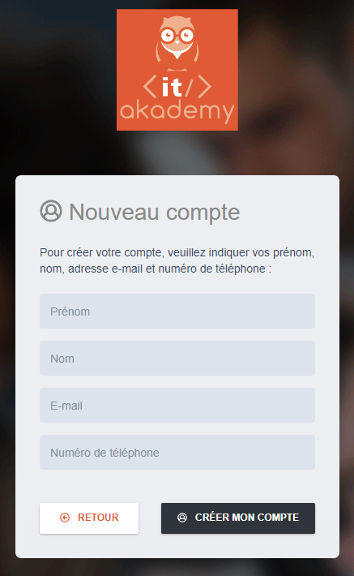
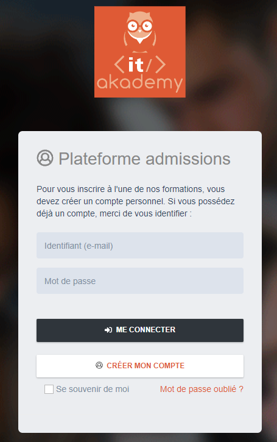
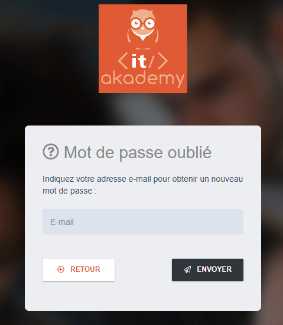
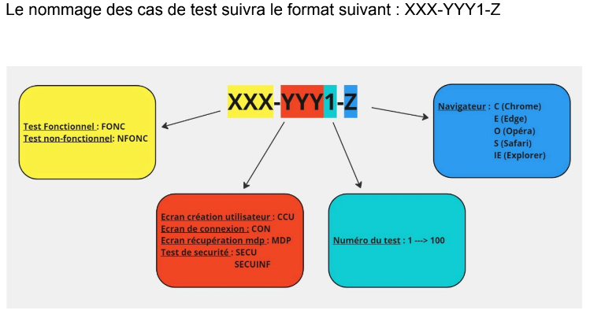

# Rédaction de cas de test / test fonctionnel
Afin de nous familiariser avec la rédaction de cas de test et les bonnes pratiques concernant l'exécution de tests, nous avons mis en place des tests fonctionnels sur trois modules du site de notre organisme de formation.  Le but est de tester les différents modules afin de déceler les éventuels défauts. 

### Le tableau de synthèse est consultable [ICI](https://docs.google.com/spreadsheets/d/1Jrd9wfgYacOR8oP4kxeDFXGI0FDILyfVdYa4s2JK7Ac/edit?gid=0#gid=0).

#### URL de la page: https://inscription.it-akademy.fr/  
#### **Module à tester (test fonctionnel):**
      
#### **Test non-fonctionnel:** 
  - Test de compatibilité navigateur (chrome, safari, edge, opéra...)
  - Test des messages d'erreur
  - Test de l'état de déconnexion 

#### Déroulé:
  - Définition dela stratégie de test
    - Regle de nommage
    - Stratégie de test fonctionnel
    - Stratégie de test non-fonctionnel
  - Rédaction des cas de test
  - Execution des tests
  - Automatisaton des tests --> [Script Python](script/test_connexion.py)

## Voici un appercu des étapes clés 
#### Règles de nommage

#### Rédaction des cas de test 

#### Mise en place d'un tableau de synthèse 

#### Automatisation des tests --> [Script Python](script/test_connexion.py)

